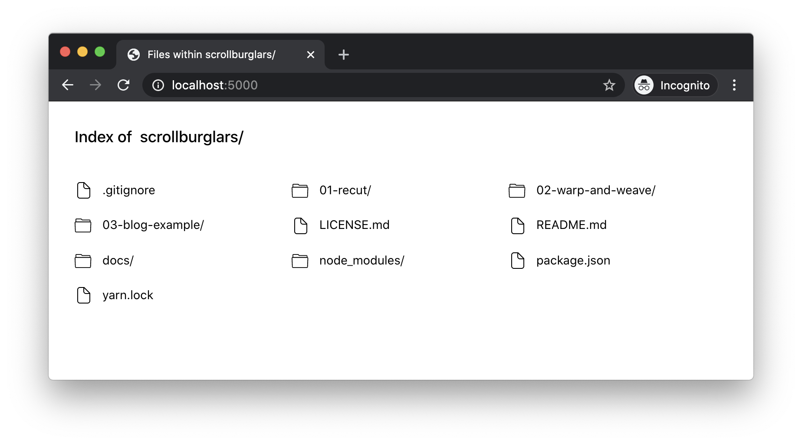
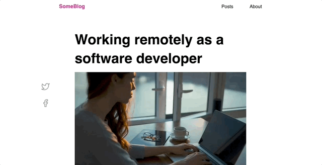

# Scrollburglars Exercise

In this exercise, your goal is to find and fix the scrollburglars across 3 different projects.

## Running the projects

Start by installing NPM dependencies (`npm install`).

Run a local fileserver by running `npm start`.

Visit http://localhost:5001, and you'll see a list of files:

The projects are numbered. Start by clicking "01-recut" to view the first project.

## Solution format

You might be wondering: How do I 'submit' my solution? Where do I apply it?

For these exercises, the goal is to get some practice with the ideas, so it doesn't really matter where you apply your solution. You can add it to the relevant HTML/CSS files, or you can do it right in the browser devtools if you'd prefer.

## Exercise 1: Recut

Recut is software that helps with video editing, created by Dave Ceddia.

Our goal, as with all of these exercises, is to find and fix the scrollburglar, and to do so in a way that makes it less likely for the issue to reoccur.

**NOTE:** This is a Tailwind project, but we aren't running the Tailwind build process. As a result, you won't be able to use Tailwind utilities. Instead, you should write CSS the "typical" way.

**Solution**: The horizontal overflow is caused by the image on mobile. To fix it, we can apply `max-width: min(100%, 28rem)`, or for a more Tailwind agnostic solution `width: 100%;` but account for if the image is smaller than 100% on mobile by using object-fit: none if filling isn't desired.

## Exercise 2: Warp and Weave

Warp and Weave is an online course that teaches weavers how to use color effectively. It's a wonderful site created by Tien Chiu. It also has a horizontal overflow on mobile. Your goal is to fix it.

This page was built using a site builder, and the markup is a bit of a mess. Feel free to fix this solution in the devtools by adding CSS or deleting superfluous HTML elements.

**Solution**: I don't know. Seems like it's just hard to find. Not sure what the intention of the div was on mobile, seems like it's best to just hide it w/ display: none, or at least set the inside contents to width: 100%;

It's a positioned stripe flair that shouldn't be present on mobile

## Exercise 3: Blog example

I created this third and final example, and it's a tricky one!

Specifically, in addition to removing the horizontal overflow, you must also take care not to break the sticky social icons on desktop:

**Solution**: Not satisfied with this one.

Easy to identify. But hmm. Not sure of how to get it working. It's easy to remove the translateX causing the overflow but then it's not the intended effect. overflow: hidden causes it to cut off. I think the best way is a little tedious, maybe opening extra room in the container... but it just still isn't right.

Could also change the positioning.

The actual solutions are a bit more complex. Overflow hidden creates the intended effect only if it's on a higher ancestor than the direct parent (akin to the page). Another way is to make a copy layer and use position relative to get about the same dimensions.
